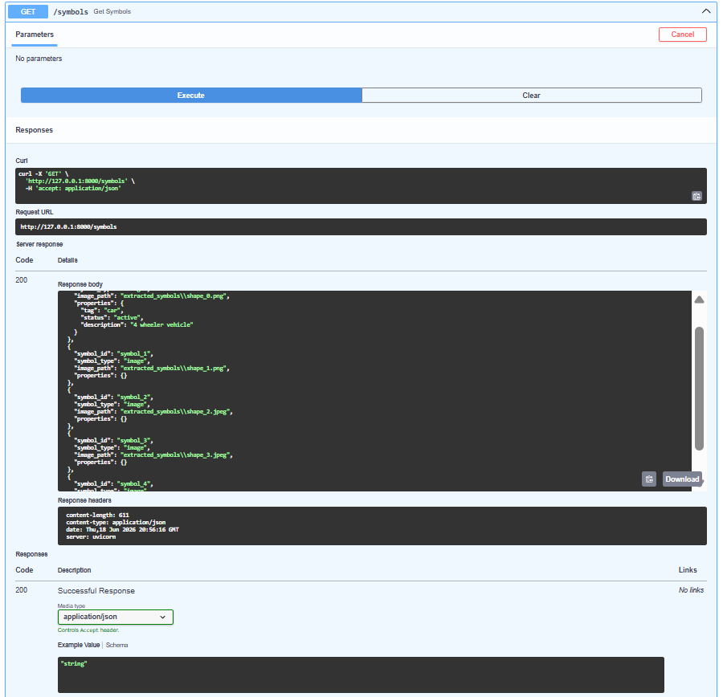

# PDF Symbol Extractor

A Python-based system for extracting symbols from PDF documents and representing them as editable symbol entities with structured metadata. The project processes PDF files, identifies both embedded image symbols and vector-based drawing symbols, generates metadata automatically, and provides REST APIs for managing custom properties.

## Overview

Engineering and technical PDF documents often contain symbols represented as a combination of embedded images, vector drawings, and text annotations. This project extracts visible symbols from PDF files, converts them into individual symbol entities, generates metadata for each extracted symbol, and exposes them through a FastAPI-based backend.The implementation was developed and validated using the provided Code Breaker PDF assignment, which contains both embedded raster images and vector-based engineering symbols.

Each extracted symbol can be assigned custom properties such as tags, descriptions, and status information through API endpoints.

## Features

* Extract visible symbols from PDF documents
* Support both raster image symbols and vector drawing symbols
* Automatically generate metadata for extracted symbols
* Store symbol information in JSON format
* Retrieve symbol information through REST APIs
* Assign and update custom properties for symbols
* Health monitoring endpoint
* Interactive API documentation using Swagger UI
* Lightweight and extensible architecture

## System Workflow

```text
PDF Document
      │
      ▼
PDF Analysis
      │
      ▼
Image & Vector Symbol Extraction
      │
      ▼
Metadata Generation
      │
      ▼
JSON Storage
      │
      ▼
FastAPI Backend
```

## Project Structure

```text
pid-symbol-extractor/
│
├── images/
│   ├── swagger-ui.png
│   ├── get-symbol.png
│   └── update-symbol.png
│
├── input/
│   └── Code Breaker.pdf
│
├── outputs/
│   ├── metadata/
│   │   └── symbols.json
│   │
│   └── pages/
│       └── Code Breaker_page_1.png
│
├── .gitignore
├── README.md
├── app.py
├── detect_vector_drawings.py
├── extract_drawings.py
├── extract_symbols.py
├── generate_metadata.py
├── models.py
├── pdf_to_image.py
└── requirements.txt
```

## Architecture

```text
PDF Document
      │
      ▼
PyMuPDF Processing
      │
      ├──────────────┐
      ▼              ▼
Image Extraction   Vector Drawing Extraction
      │              │
      └──────┬───────┘
             ▼
      Symbol Generation
             │
             ▼
      Metadata Generation
             │
             ▼
         symbols.json
             │
             ▼
          FastAPI
```

## Screenshots

### API Documentation

Interactive Swagger UI for testing and exploring API endpoints.


---

### Retrieving Extracted Symbols

The `/symbols` endpoint returns all extracted symbols along with their metadata and assigned properties.



---

### Updating Symbol Properties

Custom properties can be assigned and updated using the PUT endpoint.

Example:

```json
{
    "tag": "PV-1000",
    "status": "active",
    "description": "Pressure Vessel"
}
```


---

## Installation

```bash
git clone https://github.com/manishmahara23/pid-symbol-extractor.git

cd pid-symbol-extractor

python -m venv .venv

.venv\Scripts\activate

pip install -r requirements.txt
```

## Usage

### 1. Extract Embedded Symbols

```bash
python extract_symbols.py
```

### 2. Extract Vector Drawing Symbols

```bash
python extract_drawings.py
```

### 3. Generate Metadata

```bash
python generate_metadata.py
```

### 4. Run the API

```bash
uvicorn app:app --reload
```

Swagger UI:

```text
http://127.0.0.1:8000/docs
```

## API Endpoints

| Method | Endpoint             | Description                |
| ------ | -------------------- | -------------------------- |
| GET    | /                    | API information            |
| GET    | /health              | Health check               |
| GET    | /symbols             | Retrieve all symbols       |
| GET    | /symbols/{symbol_id} | Retrieve a specific symbol |
| PUT    | /symbols/{symbol_id} | Update symbol properties   |

## Example Metadata

```json
{
    "symbol_id": "shape_0",
    "symbol_type": "engineering_symbol",
    "image_path": "extracted_symbols/shape_0.png",
    "properties": {
        "tag": "",
        "status": "pending",
        "description": ""
    }
}
```

## Technologies Used

* Python
* FastAPI
* PyMuPDF
* Pydantic
* Uvicorn
* JSON

## Challenges and Design Decisions

The provided PDF contained a mixture of embedded raster images and vector-drawn engineering symbols.

The initial implementation relied only on embedded image extraction and successfully identified 5 raster symbols. However, several engineering symbols were represented as vector drawing primitives rather than image objects.

To address this, the extraction pipeline was extended to analyze vector drawing elements using PyMuPDF. Related drawing components and nearby labels are grouped together and exported as individual symbol entities.

This approach works well for the provided PDF and allows all visible symbols to be represented in the metadata layer. However, symbol grouping currently relies on geometric proximity and may require tuning for PDFs with significantly different layouts or drawing styles.

## Limitations

- Symbol extraction is currently optimized for the structure of the provided PDF.
- Vector symbol grouping is based on geometric proximity rather than semantic understanding.
- Symbol classification is not performed automatically.
- Complex multi-page engineering drawings may require additional grouping logic.

## Future Improvements

- Automatic symbol classification using machine learning
- SVG export for vector symbols
- Improved grouping for complex engineering diagrams
- Multi-page document support
- Database-backed metadata storage
- Symbol search and filtering

## Author

**Manish Mahara**

B.Tech CSE (AI/ML & Robotics)
DIT University
