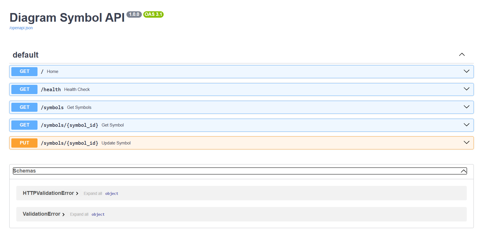
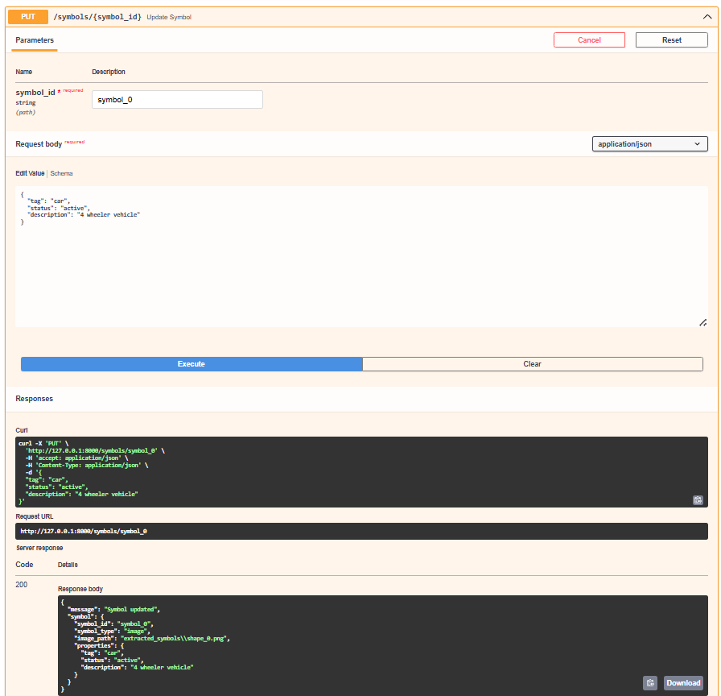

# PDF Symbol Extractor

A Python-based tool for extracting embedded symbols from PDF documents and managing them through a REST API. The project processes PDF files, extracts image-based symbols, generates metadata automatically, and allows custom properties to be assigned and updated for each symbol.

## Overview

PDF documents often contain symbols, diagrams, and engineering components that need to be managed separately from the original document. This project provides a simple workflow to extract embedded symbols, organize them into a structured format, and expose them through a FastAPI-based backend.

The current implementation focuses on extracting embedded image-based symbols from PDF files and representing them as editable entities with customizable metadata.

## Features

* Extract embedded symbols from PDF documents
* Generate metadata automatically for extracted symbols
* Store symbol information in JSON format
* Retrieve symbol information through REST APIs
* Assign and update custom properties for symbols
* Interactive API documentation using Swagger UI
* Lightweight and easy-to-extend architecture

## System Workflow

```text
PDF Document
      │
      ▼
Symbol Extraction
      │
      ▼
Metadata Generation
      │
      ▼
JSON Storage
      │
      ▼
FastAPI Backend
```

## Project Structure

```text
pid-symbol-extractor/
│
├── images/
│   ├── swagger-ui.png
│   ├── get-symbols.png
│   └── update-symbol.png
│
├── input/
│   └── Code Breaker.pdf
│
├── extracted_symbols/
│   ├── shape_0.png
│   ├── shape_1.png
│   ├── shape_2.jpeg
│   ├── shape_3.jpeg
│   └── shape_4.png
│
├── outputs/
│   └── metadata/
│       └── symbols.json
│
├── app.py
├── pdf_to_image.py
├── extract_symbols.py
├── generate_metadata.py
├── detect_vector_drawings.py
├── models.py
├── requirements.txt
└── README.md
```

## Architecture

```text
Code Breaker.pdf
        │
        ▼
extract_symbols.py
        │
        ▼
Extracted Symbols
        │
        ▼
generate_metadata.py
        │
        ▼
symbols.json
        │
        ▼
FastAPI
   ┌────┴────┐
   ▼         ▼
 GET       PUT
```

## Screenshots

### API Documentation

Interactive Swagger UI for testing and exploring API endpoints.



---

### Retrieving Extracted Symbols

The `/symbols` endpoint returns all extracted symbols along with their metadata and assigned properties.


---

### Updating Symbol Properties

Custom properties can be assigned and updated using the PUT endpoint.

Example:

```json
{
    "tag": "car",
    "status": "active",
    "description": "4 wheeler vehicle"
}
```



---

## Installation

Clone the repository:

```bash
git clone https://github.com/manishmahara23/pid-symbol-extractor.git
cd pid-symbol-extractor
```

Create a virtual environment:

```bash
python -m venv .venv
```

Activate the environment:

### Windows

```bash
.venv\Scripts\activate
```

Install dependencies:

```bash
pip install -r requirements.txt
```

## Usage

### 1. Extract Symbols

```bash
python extract_symbols.py
```

Extracted symbols will be stored in:

```text
extracted_symbols/
```

### 2. Generate Metadata

```bash
python generate_metadata.py
```

This creates:

```text
outputs/metadata/symbols.json
```

### 3. Run the API

```bash
uvicorn app:app --reload
```

API URL:

```text
http://127.0.0.1:8000
```

Swagger Documentation:

```text
http://127.0.0.1:8000/docs
```

## API Endpoints

### GET /

Returns API status information.

### GET /symbols

Returns all extracted symbols and their metadata.

### GET /symbols/{symbol_id}

Returns information for a specific symbol.

### PUT /symbols/{symbol_id}

Updates custom properties for a symbol.

Example request:

```json
{
    "tag": "PV-1000",
    "status": "active",
    "description": "Pressure Vessel"
}
```

## Example Metadata

```json
{
    "symbol_id": "symbol_0",
    "symbol_type": "image",
    "image_path": "extracted_symbols/shape_0.png",
    "properties": {
        "tag": "car",
        "status": "active",
        "description": "4 wheeler vehicle"
    }
}
```

## Technologies Used

* Python
* FastAPI
* PyMuPDF
* Pydantic
* Uvicorn

## Limitations

The current implementation extracts embedded image-based symbols available within PDF documents.

Vector drawing objects can be detected and analyzed separately, but they are not converted into editable symbol entities in the current version.

## Future Improvements

* Vector symbol extraction
* SVG export support
* Symbol classification
* Advanced metadata management
* Search and filtering capabilities

## Author

**Manish Mahara**

B.Tech CSE (AI/ML & Robotics)
DIT University
